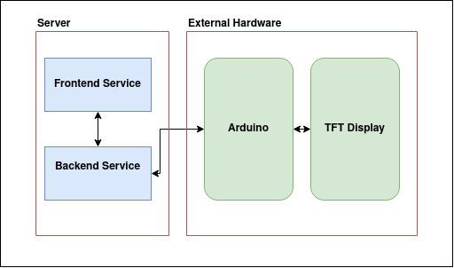
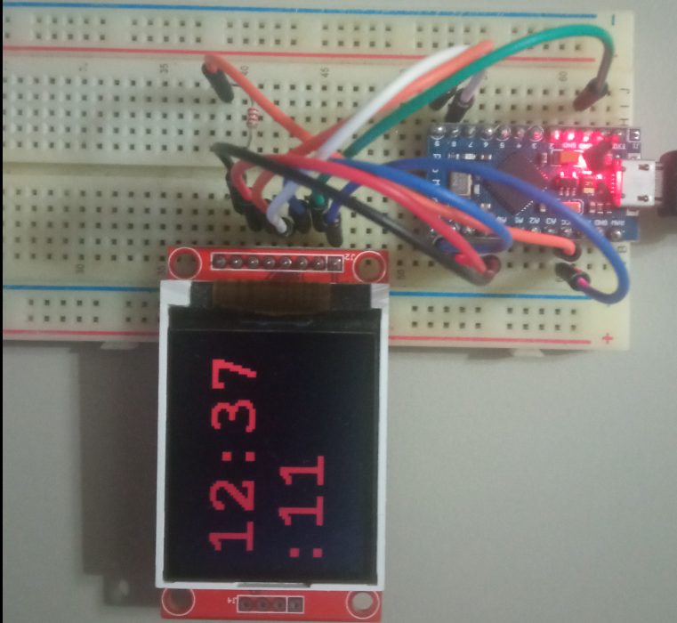

# OVERKILL TIMER

## Overview

This is a timer that displays the time on a TFT display.
This display is controlled by a microcontroller.
The microcontroller is controlled by the backend of the
web application, which in turn is controlled from the frontend.

    

## Design

| User interface in browser | Display with Arduino  |
|:-------------------------:|:---------------------:|
|           |  |

## Usage

*Notes: works only on Linux*

Run commands from main directory in following order:

    make
    make build
    make run